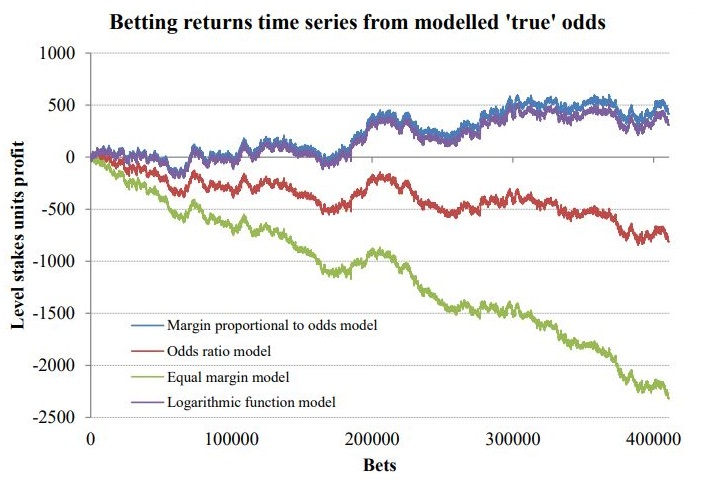
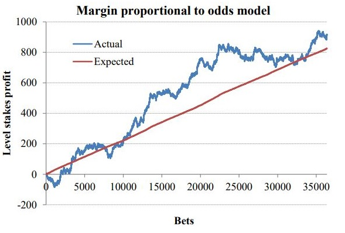

# Value Betting Software
  [](https://github.com/jss02/Value-betting-software/blob/main/LICENSE.txt)
<p align='center'><a href='https://www.pinnacle.com/en/'></a>
<a href='https://www.sportsbet.com.au/' ></a>
<a href='https://www.tab.com.au/' ></a></p>

## Description
Python program that identifies bookmaker pricings with positive expected value. Uses Pinnacle's odds to calculate the true odds of events.

### Value betting
Value betting is betting on outcomes that have a higher probability to occur than implied by the available odds, resulting in positive expected value.
<p align="center"><a href="https://www.techopedia.com/gambling-guides/value-betting" ></a></p>

For example, the true odds of a coinflip is $2 (50% chance). If we could bet on an outcome (heads or tails) for $2.1, we would have a bet with positive expected value.

$value = \frac{2.1}{2} - 1 = 0.05$

Thus, by finding bookmaker odds that are above the true odds, a profit should be made in the long term as variance diminishes with volume.

### Theory
Pinnacle has a reputation as one of the sharpest bookmakers in the world, with the smallest margins in the industry and a 'winners welcome' policy. 
By not restricting sharp bettors and offering high liquidity, they effectively price in 'sharp' information to maintain tight and accurate odds.
On the contrary, unlike Pinnacle who rely on high volume to compensate for their low margins as their business model, other bookmakers offer higher margin
but lazy (less accurate) odds. These 'soft' bookmakers focus on capturing the largest customer segment of casual players, and fixate less on accurate prices.
Consequently, the odds at soft bookmakers can temporarily be higher than the true odds implied by Pinnacle, which this software aims to exploit. 
These opportunities arise when the soft bookmaker is slow to adjust their odds compared to the sharps, or when they deliberately leave the prices skewed to 'balance the book'.


### Calculating the true odds
From <a href='https://www.football-data.co.uk/' >football-data.co.uk</a>'s <a href='https://www.football-data.co.uk/The_Wisdom_of_the_Crowd_updated.pdf#page=15'>study</a> (p.15-16) on the correlation between the expected returns (defined by the ratio of odds from
one of the 4 leading UK bookmakers to Pinnacle's implied true odds) and the actual returns, we can see that there is a strong, near 1:1 correlation. Thus, the theory that Pinnacle's odds can be used to calcalute the true odds has practical significance and 
will be utilized for this purpose.

<p align='center'><a href='https://football-data.co.uk/The_Wisdom_of_the_Crowd_updated.pdf#page=16'></a></p>

To obtain the true odds of an event, the margin from Pinnacle's odds is removed using the Margin Proportional to the Odds formula:

$odds_{true}=\frac{n\*odds_{pinnacle}}{n-M\*odds_{pinnacle}}$

Where:
- $odds_{true}$: true odds of the outcome
- $odds_{pinnacle}$: pinnacle odds of the outcome
- $n$: number of outcomes
- $M$: margin

The margin is given by:

$M=\frac{1}{odds_{1}} + \frac{1}{odds_{2}} + ... - 1 = \sum_{i=1}^n \frac{1}{odds_{i}}$  - 1

Where:
- $M$: margin
- $n$: number of outcomes

### Margin Proportional to the Odds
Margin Proportional to the Odds was chosen as it was the simplest of the two models that best yielded the true odds based on the data.
<p align='center'><a href='https://football-data.co.uk/The_Wisdom_of_the_Crowd_updated.pdf#page=10'></a></p>
- Graph represents the yield from bets with 0 expected value based on the margin models

\
It also yielded profits slightly above the expected yield when used as the model to calculate true odds.
<p align='center'><a href='https://football-data.co.uk/The_Wisdom_of_the_Crowd_updated.pdf#page=12'></a></p>

All graphs are from <a href='https://www.football-data.co.uk/The_Wisdom_of_the_Crowd_updated.pdf' >football-data.co.uk</a>.

## Installation
1. Clone the repository
```
git clone
```
2. Change to project directory
```
cd Value-betting-software
```
3. Install dependencies (virtual env recommended)
```
pip install -r requirements.txt
```

## Usage
#### Note: including Tab will open a new chrome window for every link due to headless mode being disabled by the website
To get results from all bookmakers:
```
py src/main.py
```
To get results from bookmakers excluding tab:
```
py src/main.py not_tab
```
- Note: `py` is interchangeable with `python` or `python3`

Output (stdout):
```
[{'name': '<match name>', 'outcome': '<team/draw>', 'odds': <odds>, 'value': <value in decimal>, 'datetime': <datetime object>}, ...] <link>
```

### Adding or removing links
To add a link:
1. Get links for the league of the sport you want to add
    - Pinnacle link is necessary but adding just one other bookmaker link will suffice
	- Must be the URL displaying the odds for the events of the whole league
		- Examples: <a href='assets/pin.png' >Pinnacle</a> <a href='assets/tab.png' >Tab</a> <a href='assets/sb.png' >Sportsbet</a>
2. Add to links dictionary in `link_manager.py` in the format:
```Python3
'<league_name>': {'pin': '<link for pinnacle>', 'sb': '<link for sportsbet>', 'tab': '<link for tab>'}
```

To remove a link, simply remove the key value entry for the league you want to remove from the links dictionary in `link_manager.py`.

## Credits/Acknowledgments
Theory and data from <a href='https://www.football-data.co.uk/The_Wisdom_of_the_Crowd_updated.pdf' >Wisdom of the Crowd</a> by <a href='https://www.football-data.co.uk/' >football-data.co.uk</a>.

## Potential improvements
### Multithreading
Multithreading would make the program faster as multiple websites could be scraped at once. Opening the webdriver sequentially wastes a lot of time at I/O waiting for as chromedriver which is slow to load the websites.

### Using betfair odds to calculate true odds
Pinnacle delays odds by 15 minutes for users that are not logged in. Using Betfair exchange odds through their API (costs £299) would improve the accuracy of the results.

### Adding more markets
More markets such as the line, handicaps, and player props would increase the volume of bets available and thus increase the return. However, the data in the theory only includes football 1x2 bets.

### More bookmakers
Adding more bookmakers would also increase the volume of bets available.